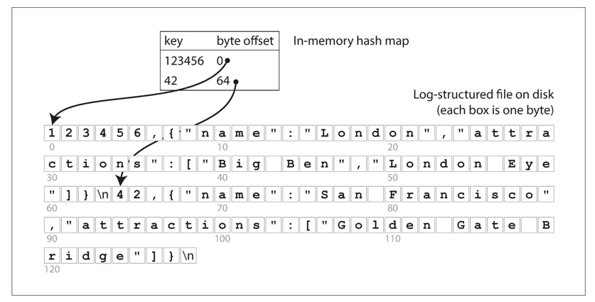

<!-- TOC -->
* [3장 저장소와 검색](#3장-저장소와-검색)
  * [데이터베이스를 강력하게 만드는 데이터 구조](#데이터베이스를-강력하게-만드는-데이터-구조)
    * [해시 색인](#해시-색인)
    * [SS테이블과 LSM 트리](#ss테이블과-lsm-트리)
    * [1단계: 첫 번째 쓰기 & SSTable A 생성](#1단계-첫-번째-쓰기--sstable-a-생성)
      * [쓰기 요청](#쓰기-요청)
      * [MemTable 상태 (flush 전)](#memtable-상태-flush-전)
      * [SSTable 상태](#sstable-상태)
      * [이벤트: MemTable이 꽉 참 → SSTable로 flush](#이벤트-memtable이-꽉-참--sstable로-flush)
      * [SSTable A 생성](#sstable-a-생성)
      * [Index Block 예시 (희소 인덱스)](#index-block-예시-희소-인덱스)
      * [결과 상태](#결과-상태)
    * [2단계: 두 번째 쓰기 & 새로운 MemTable 생성](#2단계-두-번째-쓰기--새로운-memtable-생성)
      * [쓰기 요청](#쓰기-요청-1)
      * [MemTable 상태 (현재)](#memtable-상태-현재)
      * [SSTable 상태 (변함없음)](#sstable-상태-변함없음)
    * [3단계: 병합(compaction)](#3단계-병합compaction)
      * [병합 로직](#병합-로직)
      * [SSTable B 생성](#sstable-b-생성)
      * [Index Block 예시 (희소 인덱스)](#index-block-예시-희소-인덱스-1)
      * [병합 후 상태](#병합-후-상태)
    * [4단계: 데이터 찾는 예시](#4단계-데이터-찾는-예시)
      * [예시 A: "date" 찾기](#예시-a-date-찾기)
      * [예시 B: "apple" 찾기](#예시-b-apple-찾기)
      * [전체 구조 정리 (병합 후)](#전체-구조-정리-병합-후)
      * [최종 요약](#최종-요약)
    * [B 트리](#b-트리)
    * [B 트리와 LSM 트리 비교](#b-트리와-lsm-트리-비교)
  * [Advantages of LSM-trees](#advantages-of-lsm-trees)
  * [Downsides of LSM-trees](#downsides-of-lsm-trees)
  * [트랜잭션 처리나 분석?](#트랜잭션-처리나-분석)
  * [칼럼 지향 저장소](#칼럼-지향-저장소)
<!-- TOC -->

# 3장 저장소와 검색

데이터베이스의 가장 기본적인 기능은 데이터를 저장하고 나중에 그 데이터를 요청하면 다시 데이터를 제공하는 것이다.
데이터베이스가 데이터를 저장하는 방법과 데이터를 요청했을 때 다시 찾을 수 있는 방법을 알아보자.

애플리케이션 개발자가 이를 알아야하는 이유가 무엇일까? 대부분 애플리케이션 개발자가 처음부터 저장소 엔진을 구현하기보다는
사용 가능한 여러 저장소 엔진 중에 애플리케이션에 적합한 엔진을 선택하는 작업이 필요하다.
특정 작업부하(workload) 유형에서 좋은 성능을 내게끔 저장소 엔진을 조정하려면 저장소 엔진이 내부에서 수행되는
작업에 대해 대략적인 개념을 이해할 필요가 있다.

특히 트랜잭션 작업부하에 맞춰 최적화된 저장소 엔진과 분석을 위해 최적화된 엔진 간에는 큰 차이가 있다.

## 데이터베이스를 강력하게 만드는 데이터 구조

제일 간단한 데이터베이스

```shell
#!/bin/bash

db_set() {
  echo "$1=$2" >> database
}

db_get() {
  grep "^$1, " database | sed -e "s/^$1,//" | tail -n 1
}
```

파일 저장의 특징
- 파일에 키-값 쌍을 저장한다. 키의 값을 가져온다.
- 일반적으로 파일 추가 작업은 매우 효율적이기 때문에 간단한 작업의 경우 실제로 꽤 좋은 성능을 보여준다.
- 많은 데이터베이스는 추가 전용(append-only) 데이터 파일인 로그(log)를 사용한다.

파일 저장의 단점
- 많은 레코드가 있으면 성능이 매우 좋지 않다. - 검색 비용이 O(n)이다.

데이터베이스에서 특정 키의 값을 효율적으로 찾기 위해서는 다른 데이터 구조가 필요하다. 바로 **색인(index)** 이다.
색인의 일반적인 개념은 어떤 부가적인 메타데이터를 유지하는 것이다.

색인의 특징
- 기본 데이터(primary data)에서 파생된 추가적인 구조다.
- 색인 추가와 삭제를 허용한다. 이 작업은 데이터베이스의 내용에는 영향이 없다.
- 쓰기 작업 시 오버헤드가 발생한다. 어떤 종류의 색인이라도 대개 쓰기 속도를 느리게 만든다. 왜냐하면 데이터를
쓸 때마다 매번 색인도 갱신해야 하기 때문이다.
- 쓰기의 경우 단순히 파일에 추가할 때의 성능을 앞서기 어렵다.
- 색인을 이용하면 데이터 쓰기와 읽기는 음의 상관관계를 갖는다. 즉, 색인을 추가하면 읽기 성능은 좋아지지만 쓰기 성능은 나빠진다.
- 따라서 필요 이상으로 오버헤드를 발생시키지 않으면서 애플리케이션에 가장 큰 이익을 안겨주는 색인을 선택할 수 있다.

### 해시 색인

해시 색인은 키-값 쌍을 저장하는 가장 간단한 방법 중 하나이다. 해시 색인은 키를 해싱하여 해시 테이블에 저장한다.

앞의 예제처럼 단순히 파일에 추가하는 방식으로 데이터 저장소를 구성한다고 가정해보자. 그러면 가장 간단하게 가능한
색인 전략은 다음과 같다.
- 키를 데이터 파일의 바이트 오프셋에 매핑해 인메모리 해시 맵을 유지하는 전략이다.



이 방식은 비트캐스크(Bitcask)와 같은 시스템에서 사용된다.

**비트캐스크(append-only 로그 구조 기반 저장 방식)**

특징
1. 쓰기 연산은 항상 파일 끝에 추가
→ 새로운 데이터나 수정된 데이터는 기존 데이터를 덮어쓰지 않고 파일 끝에 추가됨.
2. 파일은 세그먼트로 나뉨
→ 일정 크기가 되면 새로운 세그먼트 파일로 전환됨.
3. 데이터는 중복 가능
→ 동일한 키가 여러 세그먼트에 존재할 수 있으며, 최신 값은 가장 마지막에 위치.
4. 인메모리 인덱스 사용
→ 메모리 상에 key → (세그먼트 파일, 위치) 형태의 인덱스를 유지함.
5. 병합(compaction) 과정 존재
→ 오래된 세그먼트 파일을 주기적으로 병합하여 공간을 절약하고, 최신 값만 남김.

장점
1. 순차적 디스크 접근으로 인한 성능 최적화
→ HDD와 같은 디스크에서 랜덤 접근보다 순차 접근이 빠르기 때문에, 성능 상 이점.
2. 쓰기 지연(latency)가 낮음
→ 덮어쓰기 없이 파일 끝에 추가만 하므로, 동시성 처리도 간단하고 빠름.
3. 크래시 복구가 용이함
→ append-only 구조이므로 중간에 실패하더라도 손상 위험이 낮고, 복구 가능성이 높음.
4. 쓰기 경합이 적음
→ 같은 파일의 끝에 쓰기만 하므로 락이나 동기화 비용이 적음.

단점
1. 읽기 성능 저하 가능성
→ 동일한 키가 여러 세그먼트에 존재할 경우, 최신 값을 찾기 위해 여러 세그먼트를 탐색해야 할 수 있음. (따라서 인덱스가 필수)
2. 디스크 공간 낭비 발생
→ 삭제되거나 덮어쓰인 데이터도 여전히 파일에 존재하므로, 주기적 compaction이 필요.
3. 인메모리 인덱스 의존
→ 모든 key의 인덱스를 메모리에 유지해야 하므로, 키 수가 많아지면 메모리 부족 문제 발생 가능.
4. compaction 비용
→ 세그먼트 병합(compaction)은 디스크 I/O와 CPU 자원을 많이 소모하는 작업이므로, 적절한 스케줄링이 필요.

해시 색인은 다음의 단점이 있고 `SS테이블과 LSM 트리`를 사용하여 이를 해결한다. 
- 메모리에 저장해야 하므로 키가 너무 많으면 메모리 부족이 발생할 수 있다.
- 해시 색인은 키의 순서를 유지하지 않는다. 따라서 범위 쿼리(range query)를 지원하지 않는다.

### SS테이블과 LSM 트리

위의 세그먼트 파일의 형식에서 키-값 쌍을 키로 정렬해보자. 이처럼 키로 정렬된 형식을
**정렬된 문자열 테이블(Sorted String Table, SSTable)** 이라고 한다.

기존 로그 방식과의 차이점은 다음과 같다.
**기존 방식**
- 키-값을 쓴 순서대로 나열만 함 (정렬 없음).
- 동일한 키가 여러 번 등장 가능함 → 나중에 쓴 값이 최신으로 간주됨.

**SSTable 방식**
- 이제 파일 내부의 키-값 쌍을 정렬된 상태로 저장함 → 이를 SSTable(Sorted String Table)이라고 부름.
- 그리고 각 파일(세그먼트) 안에는 같은 키가 한 번만 등장해야 함 → 이건 병합(compaction) 과정에서 이미 해결된 상태로 가정.

**SS테이블은 해시 색인을 가진 로그 세그먼트보다 몇 가지 큰 장점이 있다.**

1. **병합(compaction)이 간단하고 메모리가 적게 듦.** 여러 SSTable 파일을 병합할 때 Merge Sort 방식을 사용함
   1. 두 정렬된 파일에서 각자의 첫 키를 비교
   2. 작은 키를 출력 파일로 복사 
   3. 다음 키 비교 … 반복
   - 이 방식은 파일이 메모리보다 커도 병합이 가능함 (조금씩 읽기 때문)

> 예:
> 
> sst1: [apple, banana, handle]
> 
> sst2: [handiwork, harvest, igloo]
> 
> → 병합 결과: [apple, banana, handle, handiwork, harvest, igloo]
> 
> 만약 두 파일에 "handle"이라는 키가 모두 있다면,
> → 더 최신 세그먼트 파일의 값을 유지하고, 이전 값은 폐기.

2. **메모리 인덱스가 작아도 된다.**

SSTable은 정렬되어 있기 때문에, 모든 키의 위치를 인덱스로 알 필요가 없음.

> 예: "handiwork"를 찾고 싶은데 정확한 위치는 모르는 경우. (인덱스가 없음)
> 
> 다만, "handbag"은 offset 1000, "handsome"은 offset 2000에 있는 상황.
> 
> → 그럼 "handiwork"는 1000~2000 사이에 있을 거라고 추정 가능
> 
> 이 덕분에 인메모리 인덱스를 일부 키만 포함한 희소 인덱스(sparse index)로 줄일 수 있음
> 
> → 메모리 사용량 감소

**SSTable & MemTable 동작 예시 정리**

### 1단계: 첫 번째 쓰기 & SSTable A 생성

#### 쓰기 요청
```
banana → 300
apple → 100
cherry → 200
```

#### MemTable 상태 (flush 전)

| 키     | 값   |
|--------|------|
| apple  | 100  |
| banana | 300  |
| cherry | 200  |

#### SSTable 상태
- 없음 (아직 디스크에 저장되지 않음)

#### 이벤트: MemTable이 꽉 참 → SSTable로 flush

#### SSTable A 생성

| 키     | 값   | Offset |
|--------|------|--------|
| apple  | 100  | 0      |
| banana | 300  | 100    |
| cherry | 200  | 200    |

#### Index Block 예시 (희소 인덱스)

| 키     | Offset |
|--------|--------|
| apple  | 0      |
| cherry | 200    |

#### 결과 상태

- MemTable: 비어 있음
- SSTable A: [apple, banana, cherry]

---

### 2단계: 두 번째 쓰기 & 새로운 MemTable 생성

#### 쓰기 요청
```
banana → 350   (업데이트)
date → 400     (새로운 키)
```

#### MemTable 상태 (현재)

| 키     | 값   |
|--------|------|
| banana | 350  |
| date   | 400  |

#### SSTable 상태 (변함없음)

- SSTable A: [apple, banana, cherry]

---

### 3단계: 병합(compaction)

#### 병합 로직

| 키     | 선택된 값 | 이유             |
|--------|-----------|------------------|
| apple  | 100       | SSTable A 유일 값 |
| banana | 350       | MemTable 값이 최신 |
| cherry | 200       | SSTable A 유일 값 |
| date   | 400       | MemTable 유일 값 |

#### SSTable B 생성

| 키     | 값   | Offset |
|--------|------|--------|
| apple  | 100  | 0      |
| banana | 350  | 100    |
| cherry | 200  | 200    |
| date   | 400  | 300    |

#### Index Block 예시 (희소 인덱스)

| 키     | Offset |
|--------|--------|
| apple  | 0      |
| cherry | 200    |


#### 병합 후 상태

- SSTable A: 삭제됨
- MemTable: 비어 있음
- SSTable B: [apple, banana, cherry, date]

---

### 4단계: 데이터 찾는 예시

#### 예시 A: "date" 찾기
1. MemTable → 없음
2. SSTable B 확인
   - Index block에서 "date"는 "cherry" 이후일 것으로 판단됨
   - Index block에는 "cherry"가 offset 200에 있음 → offset 200부터 순차적으로 스캔
   - "date" 발견

**결과: "date" → 400**

---

#### 예시 B: "apple" 찾기

1. MemTable → 없음  
2. SSTable B 확인  
   - Index block에 정확히 있음 → offset 0  
   - 즉시 접근 가능

**결과: "apple" → 100**

---

#### 전체 구조 정리 (병합 후)

| 구조      | 키 목록                    |
|-----------|----------------------------|
| MemTable  | 없음                       |
| SSTable B | apple, banana, cherry, date |

---

#### 최종 요약

| 단계   | 설명                                                        |
|--------|-------------------------------------------------------------|
| 1단계  | MemTable에 데이터 쓰기 → SSTable A로 flush                  |
| 2단계  | 새로운 데이터 쓰기 → 새로운 MemTable 생성                   |
| 3단계  | SSTable A와 MemTable 병합 → SSTable B 생성                  |
| 4단계  | SSTable B에서 인덱스 기반으로 효율적으로 탐색               |

### B 트리

- **균형 잡힌 트리 구조**로, 디스크 기반 시스템에서 널리 사용되는 인덱스 구조
- 각 노드는 여러 개의 키와 자식 포인터를 가짐
- 트리의 높이를 작게 유지하여 디스크 접근 횟수를 최소화함
- 데이터는 **정렬된 순서**로 저장되어 범위 검색이 빠름

B-Tree의 구성 요소

- **내부 노드 (Internal nodes)**: 키와 자식 노드 포인터를 포함
- **리프 노드 (Leaf nodes)**: 실제 키-값 쌍 저장, 보통 디스크 페이지와 1:1 대응
- **디스크 페이지 단위로 구성되며**, 한 페이지는 보통 4KB~8KB


디스크 I/O와 관련된 최적화

- 디스크 접근은 느리므로, **트리의 높이를 최소화**해야 함
- 이를 위해 각 노드(페이지)는 **수백 개의 키를 가질 수 있음**
  - - **분기 계수(branching factor)**: 한 페이지에서 하위 페이지를 참조하는 수
- 이로 인해 B-Tree는 **logₙ(N)**의 시간 복잡도로 검색 가능하며, `n`이 매우 큼

쓰기 동작

- 새로운 키를 삽입할 때, 정렬 순서에 따라 리프 노드에 삽입
- 노드가 가득 차면 **분할(split)** 발생 → 상위 노드에 키 승격
- 삽입은 트리 구조에 따라 재귀적으로 진행됨

장점

- **읽기 효율이 매우 뛰어남**: 정렬 + 낮은 트리 높이
- **범위 쿼리(RANGE QUERY)**에 매우 적합
- 단일 키 조회도 빠름

단점

- **쓰기 작업 시 디스크 임의 접근(random write)**이 발생
- 많은 업데이트는 **페이지 분할(split), 병합(merge)** 등을 유발하여 성능 저하 가능
- 즉, **쓰기 성능은 LSM-Tree에 비해 낮음**


### B 트리와 LSM 트리 비교

| 항목       | B-Tree                        | LSM-Tree                             |
|------------|-------------------------------|--------------------------------------|
| 데이터 정렬 | 노드 간 정렬 유지              | SSTable별 정렬 + 병합 시 정렬 유지      |
| 디스크 접근 | 랜덤 읽기/쓰기 포함             | 대부분 순차 쓰기                      |
| 쓰기 성능   | 낮음 (분할/병합 오버헤드 있음)   | 높음 (append-only 구조)              |
| 읽기 성능   | 빠름 (낮은 트리 높이 덕분)       | 상대적으로 느림 (다중 SSTable 조회 필요) |
| 범위 쿼리   | 매우 효율적                    | 효율적이지만 병합 상태에 따라 다름        |


## Advantages of LSM-trees

1. **High Write Throughput**
   - LSM-트리는 디스크에 **순차적으로 데이터 쓰기**가 가능하다.
   - 이는 **랜덤 쓰기 비용이 큰 디스크 환경에서 매우 효과적**이다.

2. **Efficient Use of Disk Bandwidth**
   - LSM-트리는 쓰기 연산을 메모리에 저장한 뒤, 배치(batch)로 디스크에 기록한다.
   - 디스크 I/O를 **큰 블록 단위로 사용할 수 있어 효율적**이다.

3. **Compaction Enables Better Compression**
   - 데이터는 정렬된 상태로 저장되므로, **압축률이 높아지고 저장 공간도 절약**된다.
   - 특히 범위가 비슷한 값들이 함께 저장되기 때문에 **block-level compression에 적합**하다.

---

## Downsides of LSM-trees

1. **High Write Amplification**
   - 컴팩션(compaction) 과정에서 같은 데이터를 여러 번 복사하게 되므로,  
     **쓰기 증폭(write amplification)**이 발생할 수 있다.

2. **High Read Amplification**
   - 하나의 키를 찾기 위해 여러 SSTable을 조회해야 할 수 있다.
   - 이로 인해 **읽기 성능이 떨어질 수 있으며**, 이는 특히 존재하지 않는 키를 조회할 때 문제가 된다.

3. **Compaction Overhead**
   - 컴팩션은 시스템 자원을 많이 소모하며,  
     **읽기 및 쓰기 성능을 일시적으로 저하시킬 수 있다**.

4. **Stale Data May Persist Longer**
   - 삭제된 데이터는 즉시 사라지지 않고 tombstone으로 남는다.
   - 이 데이터는 나중에야 제거되므로, **공간이 즉시 회수되지 않는다**.

##  트랜잭션 처리나 분석?

트랜잭션 처리(transaction processing, OLTP)와 분석 쿼리(analytics, OLAP)의 구분

현대의 데이터 시스템은 크게 두 가지 목적 중 하나를 중심으로 설계된다:

1. **온라인 트랜잭션 처리(online transaction processing, OLTP)**  
   - 주로 사용자의 상호작용에 반응하는 시스템  
   - 예: 전자상거래, 뱅킹, SNS의 상태 업데이트  
   - 데이터베이스는 **짧고 빈번한 쓰기 작업**을 효율적으로 처리해야 한다  
   - 일반적으로 데이터는 **행(row) 단위**로 조직되며, 많은 작은 쓰기가 발생

2. **온라인 분석 처리(online analytical processing, OLAP)**  
   - 주로 관리자나 데이터 분석가의 질문(query)에 응답하는 용도  
   - 예: "이번 달에 가장 많이 팔린 상품은 무엇인가?"  
   - 시스템은 **대량의 데이터를 스캔하고 집계**하는 데 최적화되어야 함  
   - 데이터는 **열(column) 단위**로 저장될 때가 많고, **읽기 최적화**가 중요함

**설계 목표의 차이점**

| 항목 | OLTP (트랜잭션 처리) | OLAP (분석 쿼리) |
|------|----------------------|------------------|
| 주요 작업 유형 | 쓰기 중심, 짧은 읽기 | 대규모 읽기, 복잡한 집계 |
| 데이터 액세스 | 행 단위(row-oriented) | 열 단위(column-oriented) |
| 사용 예 | 주문, 계좌 이체 | 매출 보고서, 사용자 행동 분석 |
| 최적화 방향 | 빠른 삽입/갱신 | 빠른 읽기/스캔 |

**통합 처리 시 고려사항**

- OLTP와 OLAP은 **상반된 성능 특성**을 요구하기 때문에,  
  하나의 시스템에서 두 요구사항을 모두 만족시키기는 어렵다.
- 따라서 많은 시스템은 **서로 다른 저장소를 구성**하거나,  
  ETL(extract-transform-load) 과정을 통해 **OLTP 데이터를 OLAP 시스템으로 복사**하는 방식을 채택함.
- 최근에는 **HTAP(hybrid transactional/analytical processing)** 시스템도 등장하여,  
  OLTP와 OLAP의 경계를 줄이려는 시도가 이루어지고 있다.

## 칼럼 지향 저장소

- 일반적인 데이터베이스는 **행(row)-지향 저장(row-oriented storage)**을 사용한다.
  - 즉, 한 행의 모든 필드를 함께 디스크에 저장함
  - 예: 이름, 이메일, 생년월일이 같은 위치에 저장됨

- 반면, **컬럼 지향 저장(column-oriented storage)**은 각 컬럼을 **별도의 파일이나 블록**에 저장함
  - 예: 이름만 따로, 이메일만 따로, 생년월일도 따로 저장

- **OLAP(온라인 분석 처리, analytics)**에서는 주로 **몇 개의 컬럼만 조회**하는 경우가 많음
  - 예: “부서별 평균 급여” → `department`, `salary` 컬럼만 필요

- 이때 행 기반 저장은 필요 없는 데이터까지 함께 읽게 되어 **디스크 I/O 낭비** 발생

- 컬럼 저장 방식은:
  - 필요한 컬럼만 읽음 → **I/O 최소화**
  - 같은 컬럼 값들이 연속적으로 저장 → **압축 효율 향상**

예시 비교

| 저장 방식 | 디스크에 저장되는 순서 |
|------------|---------------------------|
| 행 지향 | name, email, birth / name, email, birth / ... |
| 열 지향 | name, name, name / email, email, email / birth, birth, birth |

→ 열 지향 방식에서는 **동일한 컬럼이 반복되므로 압축률이 높고, 벡터 연산도 최적화 가능**


컬럼 저장의 장점

- **읽기 성능 최적화**: 필요한 컬럼만 로드 가능
- **압축 효율 우수**: 같은 유형의 값들이 연속 저장
- **벡터화 처리**에 유리: CPU 캐시에 잘 맞으며 연산 성능 향상


단점

- **쓰기 작업이 느릴 수 있음**
  - 행 전체를 삽입해야 할 때, 각 컬럼 파일을 따로 갱신해야 하므로 비효율적
- **OLTP(트랜잭션 처리)에는 부적합**
  - 빠른 삽입/갱신에는 부적절 → 주로 읽기 중심의 분석 시스템에 적합

비교

| 항목 | 행 지향(row-oriented) | 열 지향(column-oriented) |
|------|------------------------|----------------------------|
| 용도 | OLTP (쓰기 중심)       | OLAP (읽기 중심)           |
| 저장 방식 | 한 행 전체를 함께 저장    | 컬럼 단위로 따로 저장       |
| I/O 효율 | 낮음 (불필요한 필드까지 읽음) | 높음 (필요한 컬럼만 읽음)    |
| 압축률 | 낮음                    | 높음                        |
| 쓰기 성능 | 빠름                    | 느릴 수 있음                 |