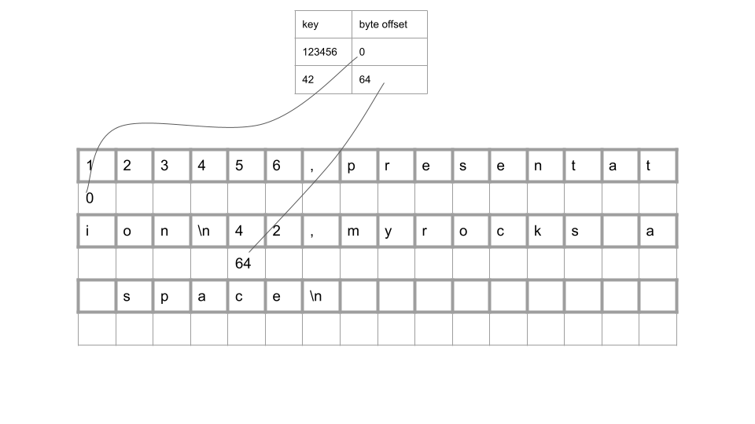
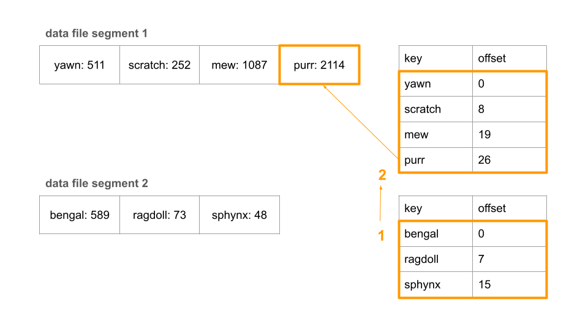
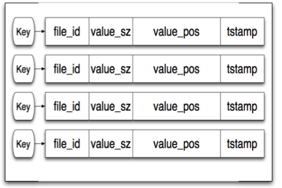

<!-- TOC -->
* [비트캐스크와 해시 색인의 동작 원리, 그리고 컴팩션 구조까지](#비트캐스크와-해시-색인의-동작-원리-그리고-컴팩션-구조까지)
  * [가장 간단한 데이터베이스로 시작](#가장-간단한-데이터베이스로-시작)
  * [색인](#색인)
  * [해시 색인](#해시-색인)
    * [비트캐스크](#비트캐스크)
    * [컴팩션](#컴팩션)
  * [해시 색인의 제한 사항](#해시-색인의-제한-사항)
  * [SSTable and LSM Tree](#sstable-and-lsm-tree)
  * [참고](#참고)
<!-- TOC -->

# 비트캐스크와 해시 색인의 동작 원리, 그리고 컴팩션 구조까지

데이터애플리케이션 3장에서 `저장소와 검색`에 대해 다룬다.
파일 기반 저장소를 시작으로 SQL, NoSQL 데이터베이스에서 사용하는 데이터 저장 구조와 검색 방식에 대해 설명한다.
애플리케이션 개발자로서 상황에 맞는 데이터베이스 선택은 중요하다.
이를 위해 데이터베이스의 내부 구조와 검색 방식을 이해하는 것이 필요하기 때문에 3장에서 언급한 자료구조와 검색 방식을 따로 정리한다.


## 가장 간단한 데이터베이스로 시작

가장 간단한 데이터베이스 방식은 파일의 마지막에 추가하고, 파일을 읽어서 검색하는 것이다.
```shell
#!/bin/bash

db_set() {
    echo "$1,$2" >> db.txt
}

db_get() {
  grep "^$1, " database | sed -e "s/^$1,//" | tail -n 1
}
```

키, 값 저장소를 함수 두 개로 구현했다.

```shell
db_set key value
```

위와 같이 키, 값을 저장하는 함수를 호출하면 데이터베이스에 key, value를 저장할 수 있다.

```shell
db_get key
```

위와 같이 키를 입력하면 해당 키에 대한 값을 검색할 수 있다.

---

이 방식은 몇가지 특징이 있다.

1. db_set을 호출할 때마다 파일의 끝에 추가하므로 키를 여러 번 갱신해도 예전 값을 덮어 쓰지 않는다.
2. 최신 값을 찾기 위해서는 파일에서 키의 마지막 항목을 찾아야 한다. (그래서 db_get에서 tail -n 1을 사용했다.)
3. 파일에 쓰기 작업은 매우 효율적이다.
4. 읽기 작업은 파일을 처음부터 끝까지 읽어야 하므로 비효율적이다. 검색 비용이 O(n)이다.


## 색인

위에서 설명한 파일에 쓰는 데이터베이스에서 특정 키의 값을 효율적으로 찾기 위해 다른 데이터 구조가 필요하다. 바로 **색인**이다.

색인의 일반적인 개념은 어떤 부가적인 메타데이터를 유지하는 것이다. 예를 들어, 파일의 각 줄에 키와 값이 저장되어 있다면,
색인은 키와 해당 키가 저장된 파일의 위치(오프셋)를 유지할 수 있다. 이 작업은 데이터베이스의 내용에는 영향을 미치지 않는다. 검색 성능에 영향을 준다.

## 해시 색인

디스크 상의 데이터를 색인하기 위해 인메모리 데이터 구조를 사용하는 것은 어떨까?

앞의 예제처럼 단순히 파일에 추가하는 방식으로 데이터 저장소를 구성한다고 가정해보자. 그러면 가장 간단하게 가능한 색인 전략은 다음과 같다.

키를 데이터 파일의 바이트 오프셋에 매핑해 인메모리 해시 맵을 유지하는 전략이다.



바이트 오프셋은 값을 바로 찾을 수 있는 위치다.

key 123456은 파일의 시작 지점에서 0 byte 떨어진 곳에 있다. key 42는 64 byte 떨어진 곳에 있다. 파일에 새로운 키-값 쌍을 추가할 때마다
방금 기록한 데이터의 오프셋을 반영하기 위해 해시 맵도 갱신해야 한다.

이 방식은 비트캐스크(Bitcask) (리악(Riak)의 기본 저장소 엔진)가 근본적으로 사용하는 방식이다. 비트캐스크는 해시 맵을 전부 메모리에 유지하기 때문에
사용 가능한 램에 모든 키가 저장된다는 조건을 전제로 고성능 읽기, 쓰기를 보장한다. 값은 한 번의 디스크 탐색으로 디스크에서 적재할 수 있기 때문에 사용
가능한 메모리보다 더 많은 공간을 사용할 수 있다.

### 비트캐스크

비트캐스크 같은 저장소 엔진은 각 키의 값이 자주 갱신되는 상황에 매우 적합하다. 예를 들어 키는 고양이 동영상의 url이고 값은 비디오가 재생된 횟수인 경우다.
이런 유형의 작업부하에서는 쓰기가 아주 많지만 고유 키는 많지 않다. 즉, 키당 쓰기 수가 많지만 메모리에 모든 키를 보관할 수 있다.

| data file segment |           |           |          |           |          |
|-------------------|-----------|-----------|----------|-----------|----------|
| mew:1078          | purr:2103 | purr:2104 | mew:1079 | mew:1080  | mew:1081 |
| purr:2105         | purr:2106 | purr:2107 | yawn:511 | purr:2108 | mew:1082 |

위의 테이블 처럼 왼쪽 위부터 오른쪽 아래로 순차적으로 키-값 쌍이 저장된다.

하지만 파일에 항상 추가만 한다면 결국 디스크 공간이 부족해진다. 이 상황은 어떻게 피할 수 있을까? 특정 크기의 세그먼트로 로그를 나누는 방식으로 해결한다.
특정 크기에 도달하면 세그먼트 파일을 닫고 새로운 세그먼트 파일에 이후 쓰기를 수행한다. 그리고 컴팩션(compaction)을 수행할 수 있다.

### 컴팩션

컴팩션은 로그에서 중복된 키를 버리고 각 키의 최신 갱신 값만 유지하는 것을 위미한다.

| data file segment |           |           |          |           |          |
|-------------------|-----------|-----------|----------|-----------|----------|
| mew:1078          | purr:2103 | purr:2104 | mew:1079 | mew:1080  | mew:1081 |
| purr:2105         | purr:2106 | purr:2107 | yawn:511 | purr:2108 | mew:1082 |

-> 컴팩션 과정 후

| 컴팩션된 세그먼트 |          |           |
|-----------|----------|-----------|
| yawn:511  | mew:1082 | purr:2108 |

컴팩션 전에 yawn, mew, purr 키가 여러 번 갱신되었지만 컴팩션 후에는 각 키의 최신 값만 유지된다.

- 컴팩션은 최신 값만 유지하기 때문에 보통 세그먼트를 더 작게 만든다.
- 세그먼트 파일은 한번 쓰여진 후 절대 변경할 수 없기 때문에 컴팩션된 세그먼트는 새로운 세그먼트로 작성된다.
- 컴팩션을 수행하는 동안 이전 세그먼트 파일을 사용해 읽기와 쓰기 요청의 처리를 정상적으로 수행할 수 있다. 병합 과정이 끝난 이후에는 읽기 요청은 이전 세그먼트
대신 새로 병합한 세그먼트를 사용하게끔 전환한다. 전환 후에는 이전 세그먼트 파일을 삭제하면 된다.

**컴팩션과 세그먼트 병합을 동시에 수행**

data file segment 1

| data file segment 1 |           |           |          |           |          |
|---------------------|-----------|-----------|----------|-----------|----------|
| mew:1078            | purr:2103 | purr:2104 | mew:1079 | mew:1080  | mew:1081 |
| purr:2105           | purr:2106 | purr:2107 | yawn:511 | purr:2108 | mew:1082 |

data file segment 2

| data file segment 2 |           |           |             |          |           |
|---------------------|-----------|-----------|-------------|----------|-----------|
| purr:2109           | purr:2110 | mew:1083  | scratch:252 | mew:1084 | mew:1085  |
| purr:2111           | mew:1086  | purr:2112 | purr:2113   | mew:1087 | purr:2114 |

-> 컴팩션과 병합 과정

| 컴팩션된 세그먼트 |             |          |            |
|-----------|-------------|----------|------------|
| yawn:511  | scratch:252 | mew:1087 | purr:2114  |

이제 각 세그먼트는 키를 파일 오프셋에 매핑한 자체 인메모리 해시 테이블을 갖는다.

---

**키의 값을 찾는 예시**



데이터가 쓰여진 순서는 data file segment 1, data file segment 2 순서라고 가정한다.
그럼 각 세그먼트별로 인메모리 해시 테이블이 있고, 인메모리 해시 테이블을 순서대로 확인한다.
최신 세그먼트 해시 맵을 먼저 확인하고 만약 키가 없다면 두 번째 최신 세그먼트를 확인한다.

책에서는 각 세그먼트별로 해시 테이블을 유지한다고 했고, Riak에서는 'keydir'[^1]이라고 부르는 하나의 해시 테이블[^2]로 유지한다.



## 해시 색인의 제한 사항

**너무 많은 메모리 공간 필요**

해시 테이블은 메모리에 저장해야 하므로 키가 너무 많으면 문제가 된다. 원칙적으로는 디스크에 해시 맵을 유지할 수 있지만 그러면 좋은 성능을 기대하기 어렵다.

**비효율적인 범위 질의(range query)**

예를들어 kitty000과 kitty999 사이의 모든 키를 쉽게 스캔할 수 없다. 해시 맵에서 모든 개별 키를 조회해야 한다.

## SSTable and LSM Tree

이러한 제한 사항을 해결하기 위해 **SSTable**과 **LSM Tree**가 등장한다.

## 참고

[^1]: [bitcask 소개 3페이지 참고](https://riak.com/assets/bitcask-intro.pdf)
[^2]: [riak bitcask backend weaknesses](https://docs.riak.com/riak/kv/2.2.3/setup/planning/backend/bitcask/index.html#weaknesses)

