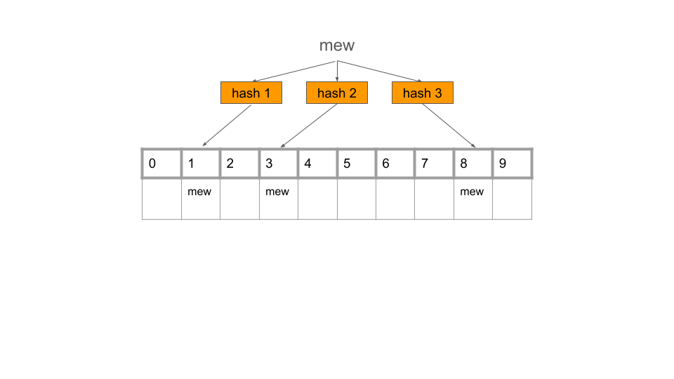
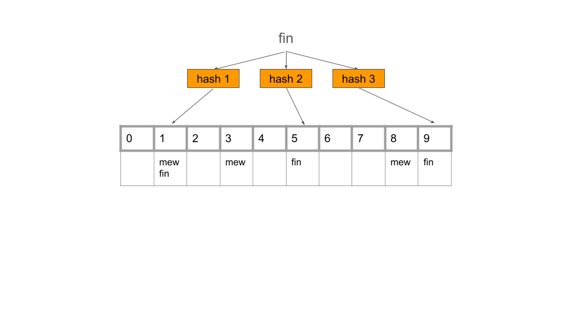

# LSM Tree와 B-Tree

해시 색인의 문제로 `너무 많은 메모리 공간 필요`, `비효율적인 범위 질의(range query)` 등이 발생한다.

이 문제를 해결하기 위해 `SSTable`과 `LSM Tree`가 등장한다.

## SS테이블과 LSM 트리

해시 색인에서 키-값 쌍을 키로 정렬하자. 이처럼 키로 정렬된 형식을 **정렬된 문자열 테이블(Sorted String Table, SSTable)** 이라고 한다.
각 키는 각 병합된 세그먼트 파일 내에 한 번만 나타나야 한다(컴팩션 과정은 이를 이미 보장한다).

SSTable은 해시 색인을 가진 로그 세그먼트보다 몇 가지 큰 장점이 있다.
- 세그먼트 병합은 파일이 사용 가능한 메모리보다 크더라도 간단하고 효율적이다. 병합정렬 알고리즘과 유사하다.
각 세그먼트의 첫번째 키를 보고 가장 낮은 키를 출력 파일로 복사한 뒤 이 과정을 반복한다. 이 과정에서 만들어진 파일도 정렬돼 있다.
각 세그먼트에 동일한 키가 있으면 가장 최근의 값을 출력 파일로 복사한다.

**data file segment 1** 

|  |              |               |                |                    |                 |
|---------------------| ------------ | ------------- | -------------- | ------------------ | --------------- |
| handbag:8786        | handful:40308 | handicap:65995 | handkerchief:16324 | handlebars:3869 | handprinted:11150 |

 **data file segment 2** 

| |               |               |                |                 |                    |
|---------------------| ------------- | ------------- | -------------- | --------------- | ------------------ |
| handcuffs:2729      | handful:42307 | handicap:67884 | handiwork:16912 | handkerchief:20952 | handprinted:15725 |

**data file segment 3** 

|  |               |                |                 |                 |              |
|---------------------| ------------- | -------------- | --------------- | --------------- | ------------ |
| handful:44662       | handicap:70836 | handiwork:45521 | handlebars:3869 | handoff:5741 | handprinted:33632 |

**merged segment 1,2,3**

|  |              |                |               |                |                 |                    |                 |              |
| ------------ | -------------- | ------------- | -------------- | --------------- | ------------------ | --------------- | ------------ | ----------------- |
| handbag:8786 | handcuffs:2729 | handful:44662 | handicap:70836 | handiwork:45521 | handkerchief:20952 | handlebars:3869 | handoff:5741 | handprinted:33632 |

---

- 파일에서 특정 키를 찾기 위해 더는 메모리에 모든 키의 색인을 유지할 필요가 없다.

그림에서 `handiwork` 키를 찾으려 하지만 세그먼트 파일에서 키의 정확한 오프셋을 알지 못한다고 가정해보자. Sparse index in memory에서 `handiwork`
키를 찾지 못한 상황이다.

그래도 handbag과 handsome 키의 오프셋을 알고 있고 정렬돼 있으므로 handiwork는 두 키 사이에 있다는 사실을 알 수 있다.
즉, handbag 오프셋으로 이동해 handiwork가 나올 때 까지 스캔하면 된다.

---

- 읽기 요청은 요청 범위 내에서 여러 키-값 쌍을 스캔해야 하기 때문에 해당 레코드들을 블록으로 그룹화하고 디스크에 쓰기 전에 압축한다.

## SS테이블 생성과 유지

레드 블랙 트리나 AVL 트리와 같이 잘 알려졌고 사용 가능한 트리 데이터 구조를 사용하면 임의 순서로 키를 삽입하고 정렬된 순서로 해당 키를 다시 읽을 수 있다.

이제 저장소 엔진을 다음과 같이 만들 수 있다.

**쓰기**
- 쓰기가 들어오면 인메모리 균형 트리 데이터 구조에 추가한다. 이 인메모리 트리는 **멤테이블(MemTable)** 이라고도 한다.
- 멤테이블이 보통 수 메가바이트 정도의 임곗값보다 커지면 멤테이블을 디스크에 SSTable로 플러시한다. 트리가 이미 정렬돼 있으므로 플러시하는 과정은 간단하다.
SS 테이블을 디스크에 기록하는 동안 쓰기는 새로운 멤테이블 인스턴스에 기록한다.

**읽기**
- 먼저 멤테이블에서 키를 찾는다. 그다음 디스크 상의 가장 최신 세그먼트에서 찾는다. 그다음으로 두 번째 오래된 세그먼트, 세 번째 오래된 세그먼트 순으로 찾는다.
- 가끔 세그먼트 파일을 합치고 덮어 쓰여지거나 삭제된 값을 버리는 병합과 컴팩션 과정을 수행한다. 이 과정은 백그라운드에서 수행된다.

## SSTable에서 LSM 트리 만들기

이 색인 구조는 로그 구조화 병합 트리(Log-Structured Merge Tree, LSM Tree)라고 한다. 이 색인 구조는 로그 구조화 파일 시스템의 초기 작업의 기반이 됐다.
정렬된 파일 병합과 컴팩션 원리를 기반으로 하는 저장소 엔진을 LSM 저장소 엔진이라 부른다.

루씬(Lucene)은 엘라스틱서치나 솔라에서 사용하는 전문 검색 색인 엔진이다. 루씬은 **용어 사전(term dictionary)**을 저장하기 위해 유사한 방법을 사용한다.
전문 색인은 키-값 색인보다 훨씬 더 복잡하지만 이와 유사한 개념을 기반으로 한다.

검색 질의로 단어가 들어오면 단어가 언급된 모든 문서를 찾는다.
이 접근법은 키를 단어(용어)로, 값은 단어를 포함한 모든 문서의 ID 목록으로 하는 키-값 구조로 구현한다. 루씬에서 용어와 포스팅 목록의 매핑은 SSTable 같은
정렬 파일에 유지하고 필요에 따라 백그라운드에서 병합한다.

## 성능 최적화

**존재하지 않는 키를 찾는 경우**
데이터를 읽을 때 멤테이블에서 키를 찾고 없으면 순차적으로 최신의 세그먼트를 읽는다. 키를 찾을 때 까지 모든 세그먼트를 읽어야한다.
이런 종류의 접근을 최적화하기 위해 저장소 엔진은 보통 **블룸 필터(Bloom filter)**를 추가적으로 사용한다.

### 블룸 필터

블룸 필터는 공간 효율적인 확률적 자료구조(probabilistic data structure)로, 특정 키가 집합에 포함되지 않았는지 빠르게 확인할 수 있다.
단, 오류 확률을 허용하고 다음의 특징이 있습니다.
- 존재하지 않음을 확인할 때는 정확함 (true negative)이 보장됨
- 존재함을 확인할 때는 거짓 양성(false positive)이 발생할 수 있음

구성 요소
- 고정 크기의 비트 배열
- 여러 개의 해시 함수

데이터 삽입 과정
1. 삽입할 키에 여러 개의 해시 함수를 적용합니다.
2. 각 해시 함수의 결과 위치에 해당하는 비트를 1로 설정합니다.

조회 과정
1. 조회할 키에 동일한 해시 함수를 적용합니다.
2. 해시 결과 위치의 비트가 모두 1인지 확인한다.
- 하나라도 0이면: 해당 키는 존재하지 않음
- 모두 1이면: 해당 키가 존재할 수도 있음 (오류 가능). 실제 SSTable에서 확인해야 함

LSM Tree에서 각 SSTable에 대해 블룸 필터를 유지할 수 있다. 블룸 필터는 SSTable의 키가 존재하지 않는지 빠르게 확인할 수 있게 해준다.

해시함수 1, 2, 3을 사용해 입력 키를 해싱하고, 해시값을 비트 배열의 인덱스로 사용한다. 해당 인덱스의 비트를 1로 설정한다.
mew, fin 키를 삽입한 예시다. 아래에 첫번째 행이 비트 배열이고 두번째 행이 해시 함수의 결과로 설정된 비트 인덱스다. 1로 설정하지만
예시를 위해 key 값을 넣어두었다. 키 값이 있는건 1로 설정되었다고 보면 된다.

`mew` 키를 입력하면 블룸 필터가 어떻게 변경되는지 살펴보자.
해시 함수에 대해 결과가 각 1, 3, 8이 나온다. 이 인덱스의 비트를 1로 설정한다.

이제 `fin` 키를 입력해보자.
해시 함수에 대해 결과가 각 1, 5, 9가 나온다. 이 인덱스의 비트를 1로 설정한다.

이제 bengal 키를 조회해보자.
bengal 키를 해싱하면 1, 2, 3 해시 함수의 결과로 각각 2, 5, 8 인덱스가 나온다. 이 인덱스의 비트가 모두 1인지 확인한다.
이 경우 2는 0이므로 '하나라도 0이면 해당 키는 존재하지 않는다'는 블룸 필터의 성질에 따라 bengal 키는 존재하지 않는다고 판단할 수 있다.

거짓 양성(false positive)이 발생할 수 있다. 예를 들어 `ragdoll` 키를 조회해보자.
ragdoll 키를 해싱하면 1, 2, 3 해시 함수의 결과로 각각 3, 8, 9 인덱스가 나온다. 이 인덱스의 비트가 모두 1이므로 블룸 필터는 ragdoll 키가 존재한다고 판단한다.
