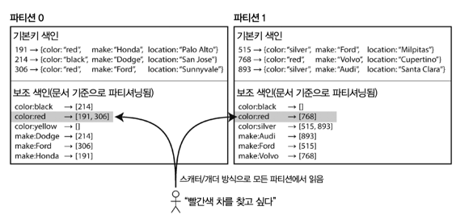

<!-- TOC -->
* [Partitioning](#partitioning)
  * [파티셔닝과 복제](#파티셔닝과-복제)
  * [키-값 데이터 파티셔닝](#키-값-데이터-파티셔닝)
    * [키 범위 기준 파티셔닝](#키-범위-기준-파티셔닝)
    * [키의 해시값 기준 파티셔닝](#키의-해시값-기준-파티셔닝)
    * [쏠린 작업부하와 핫스팟 완화](#쏠린-작업부하와-핫스팟-완화)
  * [파티셔닝과 보조 색인](#파티셔닝과-보조-색인)
    * [문서 기준 보조 색인 파티셔닝](#문서-기준-보조-색인-파티셔닝)
    * [용어 기준 보조 색인 파티셔닝](#용어-기준-보조-색인-파티셔닝)
  * [파티션 재균형화](#파티션-재균형화)
    * [재균형화 전략](#재균형화-전략)
    * [운영: 자동 재균형화와 수동 재균형화](#운영-자동-재균형화와-수동-재균형화)
  * [요청 라우팅](#요청-라우팅)
    * [병렬 질의 실행](#병렬-질의-실행)
  * [정리](#정리)
<!-- TOC -->

# Partitioning

데이터셋이 매우 크거나 질의 처리량이 매우 높다면 복제만으로는 부족하고 데이터를 **파티션**으로
쪼갤 필요가 있다. 이 작업을 **샤딩**이라고 한다.

파티션을 나눌 때는 보통 각 데이터 단위(레코드, 로우, 문서)가 하나의 파티션에 속하게 한다.

데이터 파티셔닝을 원하는 주된 이유는 **확장성**이다. 

## 파티셔닝과 복제

보통 복제와 파티셔닝을 함께 적용해 각 파티션의 복사본을 여러 노드에 저장한다.

각 레코드는 정확히 한 파티션에 속하더라도
이를 여러 다른 노드에 저장해서 내결함성을 보장할 수 있다는 의미다.

한 노드에 여러 파티션을 저장할 수도 있다. 리더 팔로워 복제 모델을 사용한다면 파티셔닝과 복제의 조합은
다음 그림과 같다. 각 파티션의 리더는 하나의 노드에 할당되고 팔로워들은 다른 노드에 할당된다.
각 노드는 어떤 파티션에게는 리더이면서 다른 파티션에게는 팔로워가 될 수 있다.

## 키-값 데이터 파티셔닝

대량의 데이터를 파티셔닝할 때 어떤 레코드를 어느 노드에 저장할지 어떻게 결정할까?

파티셔닝의 목적? 데이터의 질의 부하를 노드 사이에 고르게 분산하는 것.

파티셔닝이 고르게 이뤄지지 않아 질의를 많이 받는 파티션이 있다면 **쏠렸다(skewed)** 고 말한다.

쏠림이 있으면 파티셔닝의 효과가 매우 떨어진다. 불균형하게 부하가 높은 파티션을 **핫스팟**이라고 한다.

핫스팟을 회피하는 가장 단순한 방법은 레코드를 할당할 노드를 무작위로 선택하는 것인데,
데이터가 노드들 사이에 고르게 분산되지만 어떤 레코드를 읽으려고 할 때 해당 레코드가
어느 노드에 있는지 알 수 없으므로 모든 노드에 질의를 보내야 한다.

### 키 범위 기준 파티셔닝

파티셔닝하는 방법 중 하나는 종이 백과사전처럼 각 파티션에 연속된 범위(어떤 최솟값
에서 최댓값까지)의 키를 할당하는 것이다. 각 범위들 사이의 경계를 알면 어떤 키가 어느 파티션에
속하는지 쉽게 찾을 수 있다. 또 어떤 파티션이 어느 노드에 할당됐는지 알면 적절한 노드로 요청을
직접 보낼 수 있다.

키 범위 크기가 반드시 동일할 필요는 없다. 데이터가 고르게 분포하지 않을 수도 있기 때문이다.
예를 들어 그림의 1권은 A나 B로 시작하는 단어를 포함하지만 12권은 T, U, V, W, X, Y, Z로 시작하는 단어만 포함한다.

알파벳 두 글자마다 한권씩 할당하면 다른 것들보다 훨씬 커지는 권이 생긴다. 데이터를 고르게
분산시키려면 파티션 경계를 데이터에 맞춰 조정해야 한다.

파티션 경계는 관리자가 수동으로 선택하거나 데이터베이스에서 자동으로 선택되게 할 수 있다.
이런 식으로 파티셔닝하는 전략은 빅테이블, 빅테이블의 오픈소스 구현체인 HBase, 리싱크DB,
버전 2.4 이전의 몽고DB에서 사용된다.

각 파티션 내에서는 키를 정렬된 순서로 저장할 수 있다. (ss테이블과 LSM 트리 참고)
이렇게 하면 범위 스캔이 쉬워지는 이점이 있고, 키를 연쇄된 색인으로 간주해서 질의 하나로 관련
레코드 여러개를 읽어오는 데 사용할 수 있다.

그러나 키 범위 기준 파티셔닝은 특정 접근 패턴이 핫스팟을 유발하는 단점이 있다.
타임스탬프가 키라면 파티션은 시간 범위에 대응된다.

그래서 1일치의 데이터를 파티션 하나가 담당하는 식이다. 특정 날짜에 대한 쓰기 및 읽기가
모두 동일한 파티션으로 전달되어 해당 파티션만 과부하가 걸리고 나머지 파티션은 유휴 상태로
남아 있을 수 있다.

이 문제를 회피하는 방법?
키의 첫 번째 요소로 타임스탬프가 아닌 다른 것을 사용해야 함.
센서 이름을 붙여서 파티셔닝할 때 센서 이름을 먼저 사용한 후 시간을 사용하게 할 수 있다.
동시에 동작하는 센서가 많이 있다면 부하가 파티션 사이에 더 균등하게 퍼진다.
하나의 시간 범위 내에서 여러 센서의 값을 얻고 싶다면 센서 이름마다 별개의 범위 질의를
실행해야 한다.

### 키의 해시값 기준 파티셔닝

쏠림과 핫스팟의 위험 때문에 많은 분산 데이터스토어는 키의 파티션을 정하는 데 해시 함수를 사용
한다.

좋은 해시 함수는 쏠린 데이터를 입력으로 받아 균일하게 분산되게 한다. 문자열을 입력으로 받는
32비트 해시 함수는 0과 2^32-1 사이의 무작위 숫자를 반환한다.
입력 문자열이 거의 유사해도 해시값은 숫자 범위 내에서 균일하게 분산된다.

- 파티셔닝용 해시 함수는 암호적으로 강력할 필요는 없다. 카산드라, 몽고DB는 MD5 해시 함수를 사용한다.
- 언어에 내장된 해시 함수는 적합하지 않을 수 있다. 자바의 Object.hashCode(), 루비의 Object#hash는
같은 키를 넣어도 다른 프로세스에서는 다른 해시값을 반환할 수 있다.

이 기법은 키를 파티션 사이에 균일하게 분산시키는 데 좋다.
파티션 경계는 크기가 동일하도록 나눌 수도 있고 무작위에 가깝게 선택할 수도 있다.
이런 기법을 **일관성 해싱**이라고 부르기도 한다.

하지만 키의 해시값을 사용한 파티셔닝은 키 범위 파티셔닝의 좋은 속성을 잃어 버린다.
범위 질의를 효율적으로 실행할 수 있는 능력을 잃는다.
전에는 인접했던 키들이 이제는 모든 파티션에 흩어져서 정렬 순서가 유지되지 않는다.

몽고DB에서는 해시 기반 샤딩 모드를 활성화하면 범위 질의가 모든 파티션에 전송돼야 한다.
리악, 카우치베이스, 볼드모트에서는 기본키에 대한 범위 질의가 지원되지 않는다.

카산드라는 두 가지 파티셔닝 전략 사이에서 타협한다. 카산드라에서 테이블을 선언할 때
여러 칼럼을 포함하는 **복합 기본키**를 지정할 수 있다.

키의 첫 부분에만 해싱을 적용해 파티션 결정에 사용하고 남은 컬럼은 카산드라의 SS테이블에서
데이터를 정렬하는 연쇄된 색인으로 사용한다.

따라서 복합 키의 첫 번째 칼럼에 대해서는 값 범위로 검색하는 질의를 쓸 수 없지만
첫 번째 칼럼에 고정된 값을 지정하면 키의 다른 컬럼에 대해서는 범위 스캔을 효율적으로 실행할 수 있다.

예를 들어 소셜 미디어 사이트에서 사용자 한 명이 수정한 문서 여러 개를 올릴 수도 있다.
수정한 문서의 기본키를 (user_id, update_timestamp)로 선택하면 특정한 사용자가
어떤 시간 구간에서 수정한 모든 문서를 타임스탬프 순으로 정렬해서 읽어올 수 있다.

### 쏠린 작업부하와 핫스팟 완화

키를 해싱해서 파티션을 정하면 핫스팟을 줄이는 데 도움이 된다. 그렇지만 핫스팟을 완벽히 제거할 수는 없다.

예를 들어 소셜 미디어 사이트에서 수백만 명의 팔로워를 가진 유명인이 뭔가를 하면 핫스팟이 생길 수 있다.
유명인의 글에 댓글을 작성하거나 조회를 하면 글 ID의 해시값은 동일하므로 해싱은 아무런 도움이 되지 않는다.

이제 애플리케이션에서 쏠림을 완화해야 한다. 예를 들어 요청이 매우 많이 쏠리는 키를 발견하면
각 키의 시작이나 끝에 임의의 숫자를 붙이는 것이다.

임의의 10진수 두 개만 붙이더라도 한 키에 대한 쓰기 작업이 100개의 다른 키로 균등하게 분산된다.

그러나 다른 키에 쪼개서 쓰면 읽기에서 추가 작업이 필요하다. 100개의 키에 해당하는 데이터를 읽어서
조합해야 하기 때문이다. 추가적으로 저장해야 할 정보도 있다.

이 기법은 요청이 몰리는 소수의 키에만 적용하는 게 타당하다. 쓰기 처리량이 낮은 대다수의 키에도
적용하면 불필요한 오버헤드가 생긴다. 따라서 어떤 키가 쪼개졌는지 추적할 방법도 있어야 한다.

## 파티셔닝과 보조 색인

지금까지 설명한 파티셔닝 방식은 키-값 데이터 모델에 의존한다.
레코드를 기본키를 통해서만 접근한다면 키로부터 파티션을 결정하고 이를 사용해 키를 담당하는 파티션으로 읽기 쓰기 요청을 전달할 수 있다.

보조 색인이 연관되면 복잡해진다.

### 문서 기준 보조 색인 파티셔닝

중고차 판매 웹사이트 예시. 문서 ID 기준으로 파티셔닝한다. (0~499는 파티션 0, 500~999는 파티션 1 등)

사용자들이 색상과 제조사로 필터링할 수 있게 하려면 color와 make에 보조 색인을 만들어야 함

이런 색인 방법을 사용하면 각 파티션이 완전히 독립적으로 동작한다.
각 파티션은 자신의 보조 색인을 유지하며 그 파티션에 속하는 문서만 담당한다.
그래서 문서 파티셔닝 색인은 **지역 색인(local index)** 이라고도 한다.

문서 ID에 특별한 작업을 하지 않는다면 보조 색인에 따라 데이터가 동일한 파티션에 저장된다는 보장이 없다.
그림에서 빨간색 자동차는 파티션 0에도 있고 파티션 1에도 있다.
따라서 빨간색 자동차를 찾고 싶다면 **모든** 파티션으로 요청을 보내야 한다.

이런 방법을 **스캐터/개더(scatter/gather)** 라고 한다.

여러 파티션에서 질의를 병렬 실행하더라도 스캐터/개더는 꼬리 지연 시간 증폭이 발생하기 쉽다.
그럼에도 보조 색인을 문서 기준으로 파티셔닝하는 경우가 많다.
몽고 DB, 리악, 카산드라, 엘라스틱서치, 솔라클라우드, 볼트DB는 모두 문서 기준으로 파티셔닝된
보조 색인을 사용한다.

### 용어 기준 보조 색인 파티셔닝

각 파티션이 자신만의 보조 색인을 갖게 하는 대신, 모든 파티션의 데이터를 담당하는 **전역 색인**을 만들 수도 있다.

그러나 한 노드에만 색인을 저장할 수는 없다. 해당 노드가 병목이 되어 파티셔닝의 목적을 해치기 때문이다.
전역 색인도 파티셔닝해야 하지만 기본키 색인과는 다른 식으로 할 수 있다.

모든 파티션에 있는 빨간색 자동차 정보는 색인에서 color:red 항목에 저장되지만
색깔 색인은 a부터 r까지의 글자로 시작하는 색깔은 파티션 0에, s부터 z까지의 글자로 시작하는 색깔은
파티션 1에 저장한다.

찾고자 하는 용어에 따라 색인의 파티션이 결정되므로 이런 식의 색인을 **용어 기준으로 파티셔닝됐다(term-partitioned)** 고 한다.

문서 파티셔닝 색인에 비해 읽기가 효율적이다. 스캐터/개더를 실행할 필요 없이 원하는 용어를
포함하는 파티션으로만 요청을 보내면 된다.

그러나 쓰기가 느리고 복잡하다는 단점이 있다. 단일 문서를 쓸 때 해당 색인의 여러 파티션에 영향을
줄 수 있기 때문이다(문서에 있는 모든 용어가 다른 노드에 있는 다른 파티션에 속할 수도 있다.)

이상적인 세상이라면 색인은 항상 최신 상태에 있고 데이터베이스에 기록된 모든 문서는 바로 색인에
반영돼야 한다. 하지만 용어 파티셔닝 색인을 사용할 때 그렇게 하려면 쓰기에 영향받는
모든 파티션에 걸친 분산 트랜잭션을 실행해야 하는데,
모든 데이터베이스에서 분산 트랜잭션을 지원하지는 않는다.

## 파티션 재균형화

시간이 지나면 데이터베이스에 변화가 생긴다
- 질의 처리량이 증가해서 늘어난 부하를 처리하기 위해 CPU를 더 추가하고 싶다.
- 데이터셋 크기가 증가해서 데이터셋 저장에 사용할 디스크와 램을 추가하고 싶다.
- 장비에 장애가 발생해서 그 장비가 담당하던 역할을 다른 장비가 넘겨받아야 한다.

이런 변화가 생기면 데이터와 요청이 한 노드에서 다른 노드로 옮겨져야 한다.
클러스터에서 한 노드가 담당하던 부하를 다른 노드로 옮기는 과정을 **재균형화(rebalancing)** 라고 한다.

어떤 파티셔닝 방식을 쓰는지에 무관하게 재균형화가 실행될 때 보통 만족시킬 것으로 기대되는
최소 요구사항이 있다.
- 재균형화 후, 부하(데이터 저장소, 읽기 쓰기 요청)가 클러스터 내에 있는 노드들 사이에 균등하게 분배돼야 한다.
- 재균형화 도중에도 데이터베이스는 읽기 쓰기 요청을 받아들여야 한다.
- 재균형화가 빨리 실행되고 네트워크와 디스크 I/O 부하를 최소화할 수 있도록 노드들 사이에
데이터가 필요 이상으로 옮겨 져서는 안 된다.

### 재균형화 전략

**쓰면 안되는 방법: 해시값에 모드 N 연산을 실행**

앞서 말한 것 처럼, 키의 해시값 기준으로 파티셔닝할 때는 사용 가능한 해시값 범위를 나누고 각 범위를
한 파티션에 할당하는게 최선이다.

모드 N 방식의 문제는 노드 개수 N이 바뀌면 대부분의 키가 노드 사이에 옮겨져야 한다.
이렇게 키가 자주 이동하면 재균형화 비용이 지나치게 커진다. 데이터를 필요 이상으로 이동하지 않는
방법이 필요하다.

**파티션 개수 고정**

그 방법은 간단하다. 파티션을 노드 대수보다 많이 만들고 각 노드에 여러 파티션을 할당하는 것이다.

노드 10대로 구성된 클러스터에서 실행되는 데이터베이스는 처음부터 파티션을 1,000개로 쪼개서 각 노드마다
약 100개의 파티션을 할당할 수 있다.

클러스터에 노드가 추가되면 새 노드는 파티션이 다시 균일하게 분배될 때까지 기존 노드에서
파티션 몇 개를 **뺏어올** 수 있다. 

장점
- 적은 데이터 이동으로 효율적 리밸런싱 가능
- 파티션 단위로 데이터 재배치하므로, 빠른 확장/축소 가능
- 더 좋은 로드 밸런싱 가능: 고성능 노드엔 더 많은 파티션 할당도 가능

주의점
- 파티션 수를 너무 적게 설정하면 나중에 노드 수가 많아졌을 때 확장이 어려움
- 반대로 너무 많으면 파티션 관리 오버헤드가 커짐.

**동적 파티셔닝**

키 범위 파티셔닝을 사용하는 데이터베이스에서는 파티션 경계와 개수가 고정돼 있는게 매우 불편하다.
파티션 경계를 잘못 지정하면 모든 데이터가 한 파티션에 저장되고 나머지 파티션은 텅 빌 수도 있다.
파티션 경계를 수동으로 재설정한느 것은 매우 성가시다.

이런 이유로 HBase나 리싱크DB처럼 키 범위 파티셔닝을 사용하는 데이터베이스에서는 파티션을
동적으로 만든다. 데이터가 많아지거나 적어지면 동적으로 리밸런싱한다.
B트리의 최상위 레벨에서 실행되는 작업과 유사하다.

파티션 개수가 고정된 경우와 마찬가지로 각 파티션은 노드 하나에 할당되고 각 노드는 여러 파티션을
담당할 수 있다. 큰 파티션이 쪼개진 후 부하의 균형을 맞추기 위해 분할된 파티션 중 하나가
다른 노드로 이동될 수 있다.

장점
- 파티션 개수가 전체 데이터 용량에 맞춰 조정된다.
- 데이터 양이 작으면 파티션 개수가 적어도 되므로 오버헤드도 작다.
- 데이터 양이 거대하다면 개별 파티션의 크기는 설정된 최대치로 제한된다.

특징
- 빈 데이터베이스는 파티션 경계를 어디로 정해야 할지 알 수 없으므로 시작할 때는 파티션이 하나다.
- 데이터셋이 작을 때는 모든 쓰기 요청이 하나의 노드에서 실행되고 다른 노드들은 유휴 상태에 머문다.
- 이 문제를 완화하기 위해 HBase, 몽고DB에서는 빈 데이터베이스에 초기 파티션 집합을 설정할
수 있게 한다. 이를 **사전 분할(pre-splitting)** 이라고 한다.

**노드 비례 파티셔닝**

노드 수가 늘어나면 그에 비례해 파티션 수 자체를 늘리는 방법도 있다.

장점
- 유연한 확장성: 노드 수에 따라 파티션 수가 자동으로 조정된다.
- 균등한 데이터 분산: 노드당 파티션이 충분히 많으면 무작위 선택으로도 공정성 확보
- 파티션 크기 유지: 데이터 증가에 맞춰 노드 수를 늘리면 각 파티션의 데이터 크기는 일정함

주의사항
- 해시 기반 파티셔닝을 전제로 하므로, 키 순서나 범위 스캔이 어려움
- 초기 분할이나 리밸런싱 알고리즘이 비효율적이면 일시적 부하 불균형이 생길 수 있음

### 운영: 자동 재균형화와 수동 재균형화

완전 자동 재균형화는 일상적인 유지보수에 손이 덜 가므로 편리할 수 있다. 하지만 예측하기
어렵기도 하다. 재균형화는 요청 경로를 재설정해야 하고 대량의 데이터를 노드 사이에 이동해야
하므로 비용이 큰 연산이다. 자동화는 자동 장애 감지와 조합되면 위험해질 수 있다.

이런 이유로 재균형화 과정에 사람이 개입하는 게 좋을 수도 있다. 완전 자동 처리보다는
느릴 수 있지만 운영상 예상치 못한 일을 방지하는 데 도움될 수 있다.

## 요청 라우팅

데이터셋을 여러 장비에서 실행되는 여러 노드에 파티셔닝했는데, 클라이언트에서 요청을 보내려고 할 때
어느 노드로 접속해야 하는지 어떻게 알 수 있을까?

1. 클라이언트가 아무 노드에나 접속하게 한다(예를 들어 라운드로빈 로드 밸런서를 통해). 만약 해당 노드에 마침 요청을 적
용할 파티션이 있다면 거기서 요청을 직접 처리할 수 있다. 그렇지 않으면 요청을 올바른 노드로 전달해서 응답을 받고 클
라이언트에게 응답을 전달한다.
2. 클라이언트의 모든 요청을 라우팅 계층으로 먼저 보낸다. 라우팅 계층에서는 각 요청을 처리할 노드를 알아내고 그에 따라
해당 노드로 요청을 전달한다. 라우팅 계층 자체에서는 아무 요청도 처리하지 않는다. 파티션 인지(partition-aware) 로드
밸런서로 동작할 뿐이다.
3. 클라이언트가 파티셔닝 방법과 파티션이 어떤 노드에 할당됐는지를 알고 있게 한다. 이 경우 클라이언트는 중개자 없이 올
바른 노드로 직접 접속할 수 있다.

### 병렬 질의 실행

분석용으로 자주 사용되는 대규모 병렬 처리(massively parallel processing, MPP) 관
계형 데이터베이스 제품은 훨씬 더 복잡한 종류의 질의를 지원한다. 전형적인 데이터 웨어하우스 질
의는 조인(join), 필터링(filtering), 그룹화(grouping), 집계(aggregation) 연산을 몇 개 포함한
다.

MPP 질의 최적화기는 복잡한 질의를 여러 실행 단계와 파티션으로 분해하며 이들 중 다수는 데
이터베이스 클러스터 내의 서로 다른 노드에서 병렬적으로 실행될 수 있다.

## 정리