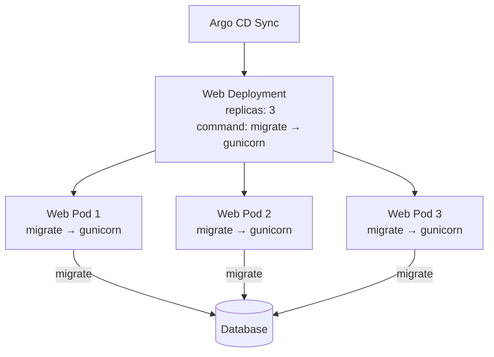
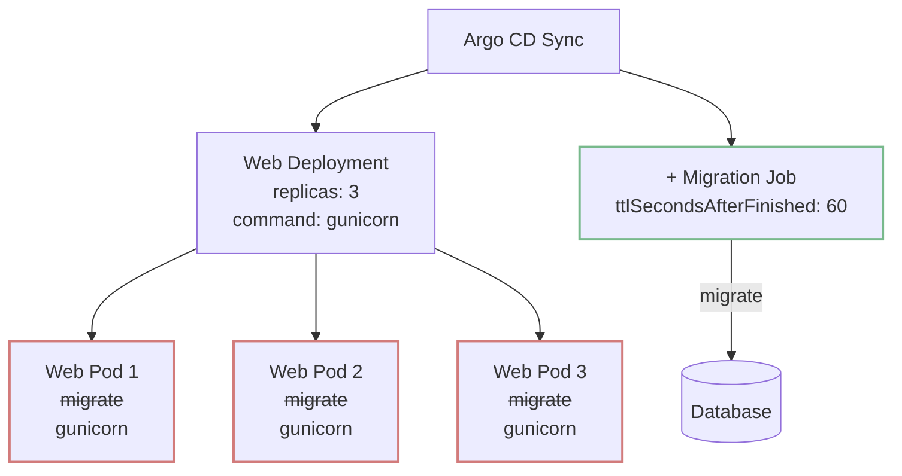
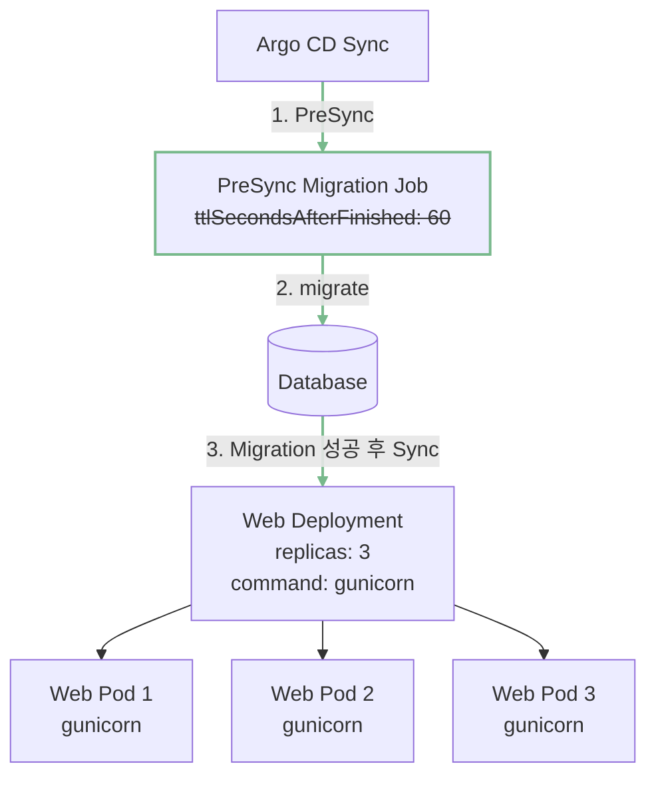

GitOps 환경에서 Migration Job은 단순히 한 번 실행하고 사라지는 리소스가 아니라 배포의 한 단계로 다뤄야 한다. 새 버전의 웹 애플리케이션이 변경된 데이터베이스 스키마를 전제로 한다면, Migration 성공은 Web Deployment의 선행 조건이어야 한다.

처음에는 Web Pod가 시작될 때마다 실행하던 `migrate`를 Kubernetes Job으로 옮기면 문제가 끝난다고 생각했다. 하지만 Job으로 분리한 뒤에도 Web Deployment와의 실행 순서는 보장되지 않았다. 완료된 Job을 지우는 TTL은 Argo CD의 동기화 상태를 어긋나게 했다. 문제는 Migration의 실행 위치만이 아니라 배포 순서와 생명주기에 있었다. 이 글에서는 이 판단이 Argo CD `PreSync` Hook으로 이어진 과정을 정리한다.

## 배포 구조 변화

### 1단계 — Web Pod마다 Migration 실행



처음에는 Web Deployment의 컨테이너 시작 명령에 Migration과 Gunicorn 실행을 함께 선언했다.

```yaml
djangoServer:
  replicaCount: 3

  command:
    - "/bin/bash"
    - "-c"
    - |
      python manage.py migrate && \
      gunicorn <WSGI_MODULE>:application <GUNICORN_OPTIONS>

migrateJob:
  enabled: false
```

#### `migrate`는 여러 번 실행해도 괜찮지 않을까?

Replica가 3개라면 세 Pod가 각각 `migrate`를 실행한다. Pod가 재시작되거나 스케일 아웃될 때도 같은 명령을 다시 실행한다.

Django는 적용이 끝난 Migration의 이력을 기록하므로, 나중에 순차적으로 실행한 `migrate`는 이미 적용된 항목을 건너뛴다. 그러나 이것이 Migration 작업 자체의 멱등성이나 동시 실행 안전성을 뜻하지는 않는다. 두 프로세스가 거의 같은 시점에 적용 대상을 계산하면 둘 다 같은 Migration을 미적용 상태로 판단할 수 있다. 이후 같은 DDL이나 `RunPython`, `RunSQL`이 겹치면 데이터베이스와 작업의 종류에 따라 잠금 대기, 이미 존재하는 테이블·컬럼 오류, 데이터 중복 같은 문제가 발생할 수 있다.

당시의 예외 종류와 발생 시각을 보여주는 기록은 남아 있지 않아 이 중 특정 오류가 실제로 발생했다고 단정할 수는 없다. 배포 설정으로 확인할 수 있는 사실은 여러 Pod가 같은 Migration을 동시에 시작할 수 있었다는 점이다. 이 구조 자체를 제거하는 것이 우선이었다.

이 구조에는 세 가지 문제가 있었다.

1. Migration이 Web Pod의 Replica 수만큼 동시에 시작될 수 있다.
2. Web Pod의 시작·재시작과 데이터베이스 스키마 변경의 생명주기가 결합된다.
3. `&&` 앞의 Migration이 실패하면 Gunicorn이 실행되지 않아 해당 Web Pod도 기동하지 못한다.

Migration 실패로 서버가 시작되지 않으면 결과적으로 잘못된 배포가 막히기도 한다. 하지만 Pod별로 Migration을 실행하는 방식은 실패 원인을 구분하기 어렵게 만든다. 데이터베이스 변경의 실행 횟수도 Web Deployment 상태에 맡긴다.

### 2단계 — Migration을 Job으로 분리



끝이 있는 일회성 작업은 Kubernetes Job의 역할과 잘 맞는다. 그래서 Web Pod의 시작 명령에서는 `migrate`를 제거하고 별도 Job을 활성화했다.

```yaml
djangoServer:
  replicaCount: 3

  command:
    - "/bin/bash"
    - "-c"
    - |
      gunicorn <WSGI_MODULE>:application <GUNICORN_OPTIONS>

migrateJob:
  enabled: true
```

```yaml
apiVersion: batch/v1
kind: Job
metadata:
  name: "<RELEASE_NAME>-migrate"
spec:
  ttlSecondsAfterFinished: 60
  template:
    spec:
      containers:
        - name: migrate
          image: "<APPLICATION_IMAGE>"
          command: ["python", "manage.py", "migrate"]
          envFrom:
            - configMapRef:
                name: "<CONFIG_MAP_NAME>"
      restartPolicy: Never
  backoffLimit: 0
```

#### Job으로 옮기면 충분하지 않을까?

이제 Migration 실행 횟수는 Web Pod의 Replica 수와 분리됐다. 그러나 이 변경만으로는 Migration이 새 Web Deployment보다 먼저 끝난다는 보장이 없다. Argo CD의 같은 Sync 단계에 Job과 Deployment가 함께 들어가므로, 새 Web Pod가 Migration 완료 전에 기동할 수 있다.

#### 완료된 Job은 TTL로 지우면 되지 않을까?

완료된 Job을 정리하기 위해 추가한 `ttlSecondsAfterFinished: 60`도 GitOps에서는 다른 문제를 만들었다. TTL 컨트롤러는 Job이 `Complete` 또는 `Failed` 상태가 된 뒤 60초가 지나면 Job과 종속 Pod를 함께 삭제한다. 반면 Helm Chart를 렌더링한 목표 Manifest에는 여전히 Job이 존재한다. 그 결과 Argo CD는 클러스터에서 사라진 Job을 `OutOfSync`로 판단했다. Migration 로그도 Pod와 함께 사라져 원인 분석이 어려워졌다.

그렇다고 TTL을 제거한 일반 Job이 매번 다시 실행되는 것은 아니다. 완료된 Job은 기본적으로 클러스터에 남는다. 고정된 `metadata.name`으로 다시 Sync해도 이미 완료된 같은 Job을 새로 생성하지 않는다. 이것은 Finalizer 때문이 아니라 완료된 Job을 보존하는 기본 생명주기 때문이다. 매번 이름을 바꾸면 새 Job을 만들 수 있다. 다만 이름 생성과 오래된 Job 정리까지 별도로 관리해야 한다.

필요한 것은 일반 리소스의 목표 상태가 아니라 배포 절차였다.

1. Sync를 시작할 때마다 새로운 Migration Job을 실행한다.
2. Migration이 성공해야 Web Deployment를 적용한다.
3. 완료된 Job과 Pod는 다음 Sync 전까지 남겨 로그를 확인한다.
4. 다음 Sync 직전에 이전 Job을 지우고 새 Job을 만든다.

### 3단계 — Argo CD PreSync로 배포 순서 보장



Argo CD Hook은 리소스에 배포 단계의 의미를 부여한다. Migration Job을 `PreSync` Hook으로 선언하면 Argo CD는 이 Job이 성공한 뒤에만 일반 Manifest를 적용하는 Sync 단계로 넘어간다. Hook이 실패하면 전체 Sync도 실패하고 Web Deployment는 적용되지 않는다.

```yaml
apiVersion: batch/v1
kind: Job
metadata:
  name: "<RELEASE_NAME>-migrate"
  annotations:
    argocd.argoproj.io/hook: PreSync
    argocd.argoproj.io/hook-delete-policy: BeforeHookCreation
spec:
  activeDeadlineSeconds: 180
  template:
    spec:
      containers:
        - name: migrate
          image: "<APPLICATION_IMAGE>"
          command: ["python", "manage.py", "migrate"]
          envFrom:
            - configMapRef:
                name: "<CONFIG_MAP_NAME>"
      restartPolicy: Never
  backoffLimit: 0
```

각 설정은 이렇게 동작한다.

- `PreSync`: Migration Job이 성공해야 Deployment를 포함한 Sync 단계를 진행한다.
- `BeforeHookCreation`: 다음 Sync에서 새 Hook을 만들기 전에 기존의 같은 이름 Hook을 삭제한다. 완료된 Job과 Pod는 그때까지 남아 있어 로그를 확인할 수 있다.
- `activeDeadlineSeconds: 180`: Job 전체 실행 시간을 제한한다. 제한 시간을 넘기면 실행 중인 Pod를 종료하고 Job을 실패 처리한다.
- `backoffLimit: 0`: 실패한 Migration Pod를 Job 컨트롤러가 다시 시도하지 않게 한다.
- `ttlSecondsAfterFinished` 제거: Kubernetes TTL 컨트롤러가 완료된 Job을 먼저 삭제해 Argo CD의 목표 상태와 어긋나는 상황을 없앤다.

결과적으로 배포 순서는 `PreSync Migration Job → Migration 성공 → Web Deployment`가 됐다. Migration이 실패하면 새 Web Deployment는 시작하지 않는다. 실패한 Job과 Pod도 다음 Sync 전까지 남아 로그를 확인할 수 있다.

다만 `PreSync`가 보장하는 것은 Migration과 새 Web Deployment 사이의 순서다. Migration이 실행되는 동안 구버전 Web Pod는 계속 요청을 처리할 수 있다. 컬럼 삭제나 이름 변경처럼 구버전 코드와 호환되지 않는 변경은 한 번에 적용하지 않는다. 새 구조를 추가한 뒤 사용이 끝난 기존 구조를 나중에 제거하는 방식으로 나눠야 한다.

## 단계별 비교

| 단계 | 실행 위치 | Replica와 분리 | Migration 선행 | 완료 Job 보존 |
|:---:|---|:---:|:---:|:---:|
| 1단계 | 각 Web Pod | X | X | X |
| 2단계 | 일반 Job | O | X | X |
| 3단계 | `PreSync` Job | O | O | O |

## 정리

Web Pod의 시작 명령에서 `migrate`를 실행하면 Migration이 Replica 수와 Pod 재시작에 영향을 받는다. 이를 Job으로 옮기면 실행 주체가 Web Pod에서 분리된다. 하지만 Web Deployment와의 순서까지 보장되지는 않는다. 완료된 일반 Job을 TTL로 삭제하는 방식도 Git에 선언된 목표 상태와 클러스터의 실제 상태를 어긋나게 했다.

Migration Job을 Argo CD `PreSync` Hook으로 전환하자 Migration이 성공한 뒤에만 Web Deployment가 적용되도록 순서가 명확해졌다. `BeforeHookCreation`은 이전 Job을 다음 Sync 직전까지 보존하며 매 Sync마다 새 Job을 실행한다.

핵심은 Job을 만드는 것이 아니라 배포 순서를 선언하는 것이다.

## 참고

- [Django Migrations](https://docs.djangoproject.com/en/stable/topics/migrations/)
- [Kubernetes Job](https://kubernetes.io/docs/concepts/workloads/controllers/job/)
- [Kubernetes TTL-after-finished Controller](https://kubernetes.io/docs/concepts/workloads/controllers/ttlafterfinished/)
- [Argo CD Sync Phases and Waves](https://argo-cd.readthedocs.io/en/stable/user-guide/sync-waves/)
